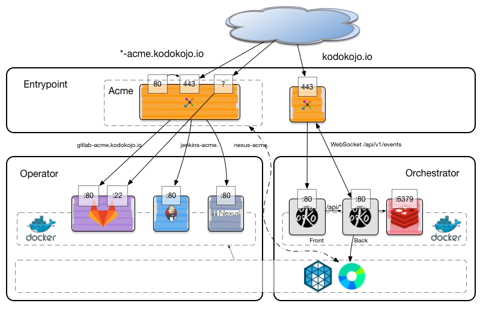

Kodo Kojo allows you to get a full out-of-the-box software factory.

If you don't want to spent your time setting up a software factory, its monitoring tools, adding and removing users on each component of your software factories; then Kodo Kojo is made for you.

Kodo Kojo uses the power of [Apache Mesos](http://mesos.apache.org/) and [Marathon](https://mesosphere.github.io/marathon/) via [Docker](https://www.docker.com/) to orchestrate and isolate your software factory tools.

[](https://gitter.im/kodokojo/kodokojo?utm_source=badge&utm_medium=badge&utm_campaign=pr-badge&utm_content=badge)

## License

`Kodo Kojo` is licensed under [GNU General Public License v3](http://www.gnu.org/licenses/gpl-3.0.en.html).

## Quickstart

### Step 1 : Clone this repository

```bash
git clone git@github.com:kodokojo/kodokojo.git
cd kodokojo
```

### Step 2 : Retrieve and build

```bash
./quickstart.sh
```

Go to [Quickstart page](doc/QUICKSTART.md) to get more details.

## Sofware factory tools supported

* [Gitlab 8.5](http://gitlab.com/)
* [Jenkins](https://jenkins.io/) now in version 1.651-2-alpine. See Issue #7 to get more detail about Jenkins 2.
* [Nexus OSS 2.13.0-01](http://www.sonatype.com/nexus-repository-oss)

## Contribute

You want to contribute? It's very nice! Feel free to read our [Contribution page](CONTRIBUTE.md) to know what guidelines we try to apply.

You may find help on our [Gitter](https://gitter.im/kodokojo/kodokojo) channel if needed. Don't be afraid to ask.

## Go further

The following scheme describes how Kodo Kojo and its components will be deployed:



HA Proxy will be managed by [kodokojo-haproxy-marathon](https://github.com/kodokojo/kodokojo-haproxy-marathon) which is registered on the Marathon event bus.
This will allow the HA Proxy configuration to be updated when a Marathon's state changes.

## Stay tuned

You can stay tuned by following us on:

* Our Website http://kodokojo.io
* Twitter : [@kodokojo](http://twitter.com/kodokojo)

## Technology inside

* [Java 8](http://java.com)
* [Maven](https://maven.apache.org/)
* [Akka](http://akka.io)
* [Sparkjava](http://sparkjava.com/)
* [Guice](https://github.com/google/guice)
* [Apache Commons](https://commons.apache.org/)
* [Apache Velocity](http://velocity.apache.org/)
* [OkHttp](http://square.github.io/okhttp/)
* [Retrofit](http://square.github.io/retrofit/)
* [Gson](https://github.com/google/gson)

We use the following tests tools:

* [Jgiven](http://jgiven.org/)
* [Docker](https://www.docker.com/) with [Docker-Java](https://github.com/docker-java/docker-java)
* [Mockito](http://mockito.org/)
* [AssertJ](http://joel-costigliola.github.io/assertj/)

Thanks to all those Open source projects which made such a project possible!
